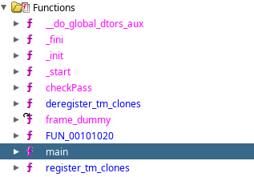

# Analyze
Let's open the level1 executable file using Ghidra

#### Implemented functions in the program:


#### We are interested in the **main and checkPass** functions:

| Function name | Description                                                                                                               |
|---------------|---------------------------------------------------------------------------------------------------------------------------|
| main          | The main entry point to the program, from which its execution starts (it also contains the request to enter the password) |
| checkPass     | Password validity check                                                                                                   |

#### main function analysis
*The comments in the code were written during reverse engineering
```cpp
undefined8 main(void)

{
  int iVar1; // bool variable that stores the result of authentication
  undefined local_48 [64]; // сhar[64] variable for storing the entered user password for further verification (maximum size 64).
  
  printf("Welcome to Easy Crack Me");
  printf("What is the Secret ?");
  
  // User password input via scanf and writing it to the local_48 variable
  __isoc99_scanf(&DAT_00102032,local_48);
  
  // Checking the entered password using the checkPass function
  iVar1 = checkPass(local_48);
  if (iVar1 == 0) {
    printf("Better luck next time. :(");
  } else {
    printf("You are correct :)");
  }
  
  return 0;
}
```

#### checkPass function analysis
```cpp
char checkPass(char *param_1)

{
  char cVar1;
  
  if (*param_1 == 's') { // check the first character in the password
    cVar1 = param_1[1]; // if it is successful, we write the next character to the variable for further comparisons
    if ((((cVar1 == 'u') && (cVar1 = param_1[2], cVar1 == 'd')) &&
        (cVar1 = param_1[3], cVar1 == 'o')) &&
       (((cVar1 = param_1[4], cVar1 == '0' && (cVar1 = param_1[5], cVar1 == 'x')) &&
        ((cVar1 = param_1[6], cVar1 == '1' && (cVar1 = param_1[7], cVar1 == '8')))))) {
      cVar1 = '\x01';
    }
  } else {
    cVar1 = '\0';
  }
  return cVar1;
}
```
## Solutions
There are two solutions to bypass this check without modifying the code:
- [Rewrite the password that is written in the if conditions of the checkPass function (very easy, not very interesting)](./solutions/solution1.md)
- Exploit a vulnerability in the algorithm and create a keygen