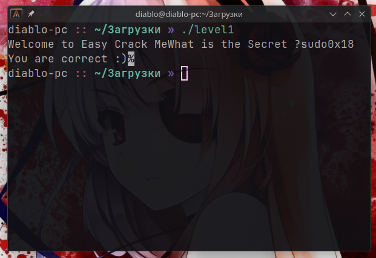

# Solution 1
Rewrite the password that is written in the if conditions of the checkPass function
```cpp
...
  if (*param_1 == 's') {
    ...
    if ((((cVar1 == 'u') && (cVar1 = param_1[2], cVar1 == 'd')) &&
        (cVar1 = param_1[3], cVar1 == 'o')) &&
       (((cVar1 = param_1[4], cVar1 == '0' && (cVar1 = param_1[5], cVar1 == 'x')) &&
        ((cVar1 = param_1[6], cVar1 == '1' && (cVar1 = param_1[7], cVar1 == '8')))))) {
      ...
    }
...
```
Each letter is compared via if conditions. You can simply take and rewrite the correct password.
#### Password: **sudo0x18**

