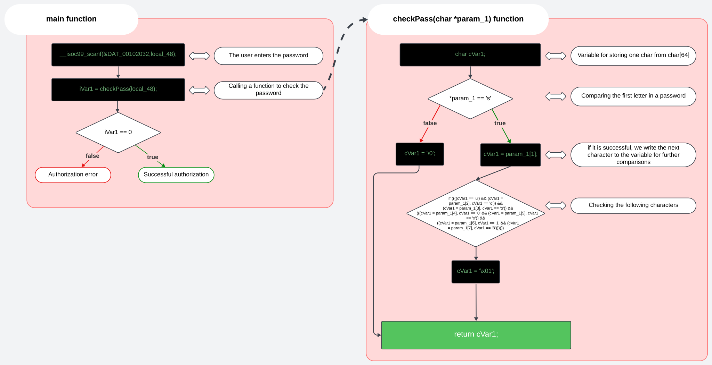
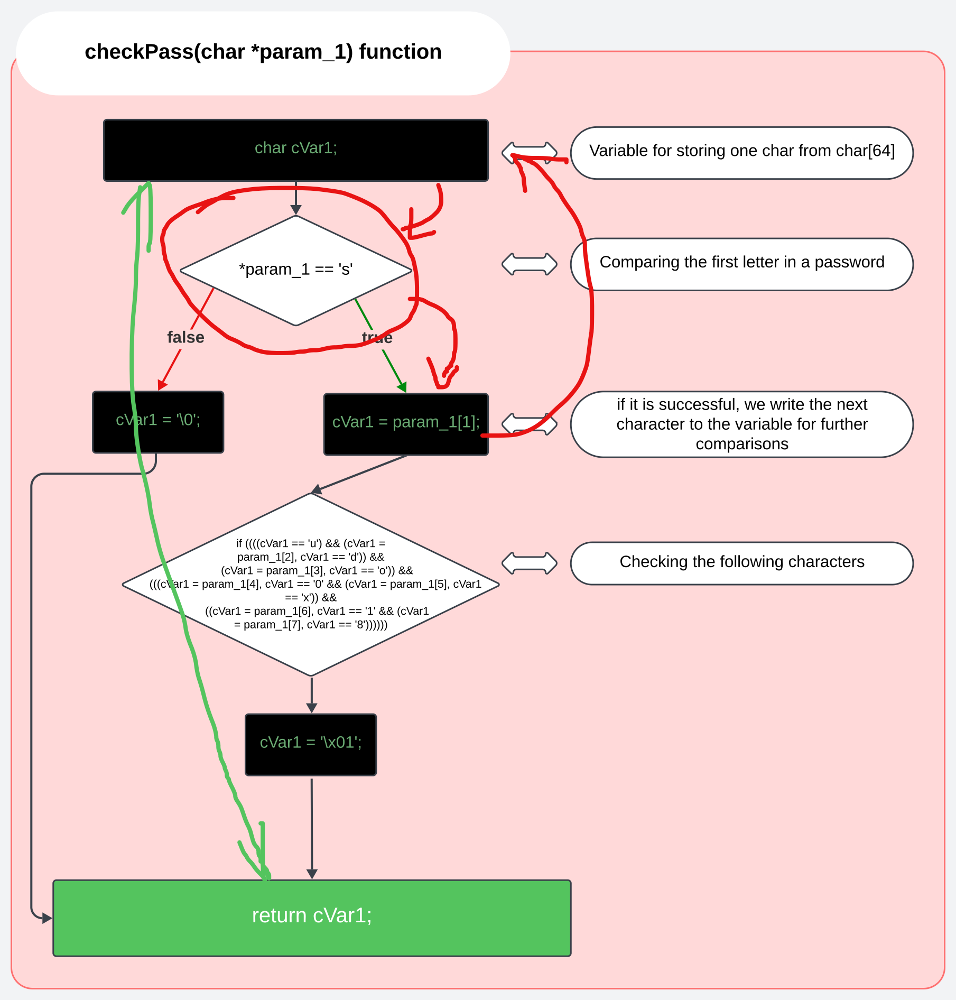

# Solution 2
Exploit a critical vulnerability in the algorithm

## How the program works in detail


## Logical vulnerability in checkPass function
The code of the checkPass function contains a vulnerability that allows successful password verification with a partially correct string. This vulnerability occurs due to a logical error and incorrect control of return values.



The return '\x01' occurs not when the whole string is validated, but as a result of successful fulfillment of one of the nested conditions. Thus, even a string starting with a valid character may pass validation if the rest of the function is executed without strict validation.

## Coding a keygen script
#### Script: [solution2_keygen.sh](../solution2_keygen.sh)


## How the vulnerability can be addressed
- Make sure that the entire password is checked to the end, and only then the function should return a successful result.
- Сan also simplify the code and make it more readable
#### Example:
```cpp
char checkPass(char *param_1) {
  const char *correct_pass = "sudo0x18";

  for (int i = 0; i < 8; i++) {
    if (param_1[i] != correct_pass[i]) {
      return '\0';
    }
  }
  
  if (param_1[8] != '\0') {
    return '\0';
  }

  return '\x01';
}
```